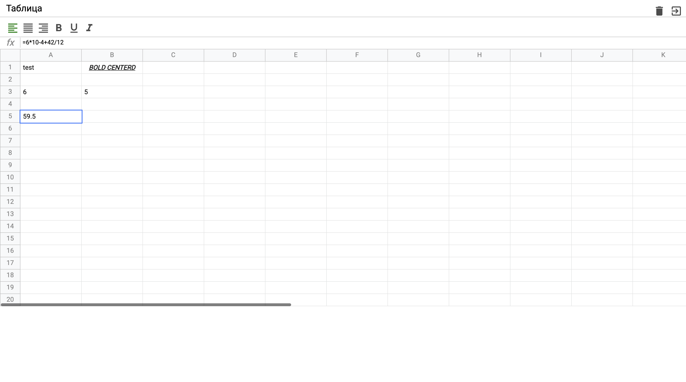

# Excel table clone on vanilla JS

## Повторение функционала excel таблицы в браузере с помощью vanilla JS

### Описание: 

Приложение, которое повторяет весь функционал desktop приложение excel
. Для написания использовался только JS. Реализован redux
. Реализован компонентный подход.

### Технологии: 
1. vanilla JS
2. webpack
3. sass as preprocessor

### Установка и запуск: 
* npm install
* npm start
